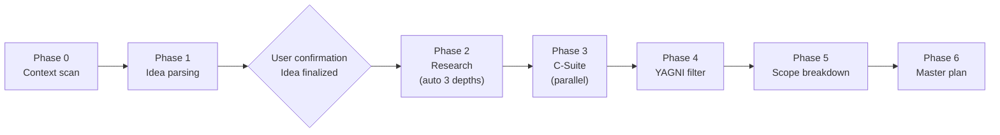

# Progressive Discovery

Related rules:
- `docs/specs/question-principles.md`
- `docs/specs/research.md`
- `docs/specs/c-suite-analysis.md`

Transforms a project idea into an actionable master plan through a structured 7-phase workflow (Phase 0-6).

## Input
- Project directory (current working directory)

## Output
- 30+ research files + master-plan.md under the `docs/00-discovery/` directory
- All discovery documents are produced in the user's conversation language

### Pre-output checklist (required before generating the master plan)

Verify every item before generating the master plan. If any item is incomplete, go back and complete it.

- [ ] Confirm output files have been created for every completed Phase
- [ ] Confirm Phase 2 research covers every selected category at the required depth
- [ ] Confirm the consensus score from the Phase 3 C-Suite analysis has been calculated
- [ ] Confirm the Phase 4 YAGNI classification covers every feature candidate
- [ ] Confirm the report language matches the user's conversation language

### Schema compliance check (required before persisting to .ww-w-ai/)

Verify the JSON output before writing to `.ww-w-ai/standards/discovery/`:
- [ ] Confirm all "required" fields in schema.json are present and non-empty
- [ ] Confirm the phases[] array contains entries for every executed Phase
- [ ] Confirm summary.phases_completed matches the actual number of completed Phases

## Output persistence

After Phase 6 completes, persist execution metadata to `.ww-w-ai/standards/discovery/`:

1. Create the `.ww-w-ai/standards/discovery/` directory if it does not exist
2. Write `latest.json` -- structured metadata following `templates/schema.json`
3. Write `latest.md` -- execution summary following `templates/report.template.md`
4. Archive to `history/` -- copy latest.json to `.ww-w-ai/standards/discovery/history/{timestamp}.json`

`latest.md` is produced in the user's conversation language. JSON field names remain in English regardless of language.
The JSON output captures execution metadata (Phases completed, number of searches, C-Suite consensus, etc.).
The full discovery output is maintained under `docs/00-discovery/`. Only the metadata is stored under `.ww-w-ai/`.

## Workflow overview



**Key point**: Once the idea is finalized in Phase 1, Phases 2-6 proceed automatically without user confirmation.

## Phase 0: Context scan

Assess the current project state.

1. Scan the current directory structure (`Glob`)
2. Check existing documentation (`CLAUDE.md`, `README.md`, `docs/`)
3. Identify the tech stack (`package.json`, `pubspec.yaml`, `Cargo.toml`, etc.)
4. Check existing PDCA history

**Output**: `docs/00-discovery/research/context.md` -- current-state summary

## Phase 1: Idea parsing + execution mode selection

Structure the user's idea and determine the execution mode.

1. Ask the user to describe the idea (`AskUserQuestion`)
2. Extract the core elements:
   - **Problem**: what problem does it solve?
   - **Target user**: who is it for?
   - **Value proposition**: how does it differ from existing alternatives?
   - **Scope**: what is the initial scope?
3. Present a structured form and obtain user confirmation
4. **Execution mode selection** (`AskUserQuestion`):

```
Choose how to execute Phases 2-6:
1. Automatic -- non-stop automatic progression through to the master plan (recommended)
2. Manual -- proceed after per-category auto/manual selection
```

| Mode | Phase 2 | Phases 3-6 | Suitable situation |
|------|---------|------------|--------------------|
| **Automatic** | all 8 categories automatic (non-stop) | all automatic | fast results, clear idea |
| **Manual** | per-category auto/manual selection | confirm after each Phase | deep analysis of specific categories |

### Manual mode -- per-category execution selection

When Manual mode is selected, decide the execution method for every category at once before Phase 2 begins (`AskUserQuestion`, `multiSelect`):

```
Select categories to run automatically (the rest will be manual):
[v] 1. User/problem validation
[v] 2. Market size and trends
[v] 3. Competitor/alternative analysis
[ ] 4. Solution/technical approach    <- manual (confirm before proceeding)
[ ] 5. Tech stack/infrastructure      <- manual
[v] 6. Content/data strategy
[v] 7. Business model
[v] 8. Legal/regulatory environment
```

- **Checked categories**: auto-progress through Depth 3, record results only
- **Unchecked categories**: present per-depth results, obtain user confirmation, allow course correction

**Output**: `docs/00-discovery/01-idea.md` -- idea structuring document + execution mode

## Phase 2: Progressive research (automatic progression)

Perform deep searches **up to Depth 3 automatically** per category. All 8 categories complete without user confirmation.

**Automatic depth progression**: categories progress depth 1 -> 2 -> 3 automatically (details: see `../../docs/specs/research.md`)

8 categories (in order, automatic):
1. User/problem validation
2. Market size and trends
3. Competitor/alternative analysis
4. Solution/technical approach
5. Tech stack/infrastructure
6. Content/data strategy
7. Business model
8. Legal/regulatory environment

Per category:
- Depth 1: 3 broad searches -> whole picture
- Depth 2: 3 deep searches on key points -> dig into core findings
- Depth 3: 3 verification searches -> cross-validation + gap filling
- Early termination possible (once sufficient information is secured)

**Cross-category parallelism**: independent categories are executed in parallel via the Agent tool. Issue multiple Agent calls simultaneously in one turn to speed up processing.

- Group A (parallel): 1. User, 2. Market, 3. Competition
- Group B (parallel, after A): 4. Solution, 5. Technology, 6. Content
- Group C (parallel, after B): 7. Business model, 8. Legal/regulation

Within each group, categories run concurrently as separate Agent calls:
```
# Group A execution example (3 Agents invoked concurrently in one turn)
Agent 1: Category 1 User/problem validation depth 1->2->3
Agent 2: Category 2 Market size and trends depth 1->2->3
Agent 3: Category 3 Competitor/alternative analysis depth 1->2->3
```

**Output**: `docs/00-discovery/research/{NN}-{category}-depth{N}.md` (category x depth)

## Phase 3: C-Suite validation

Analyze in parallel from 10 executive perspectives.

CEO, CFO, CTO, CMO, COO, CRO, CPO, CLO, CHRO, CSO
(details: see c-suite-analysis.md)

- Parallel analysis via the Agent tool. Invoke 5 Agents concurrently in one turn, analyzing the 10 perspectives in pairs:
  ```
  Agent 1: CEO + CSO (Strategy group)
  Agent 2: CFO + COO (Operations/Finance group)
  Agent 3: CTO + CPO (Product/Technology group)
  Agent 4: CMO + CHRO (Market/Talent group)
  Agent 5: CRO + CLO (Risk/Legal group)
  ```
- Conflicts between perspectives are recorded explicitly + a user decision is requested

**Output**: `docs/00-discovery/03-csuite-analysis.md` (consolidated), `docs/00-discovery/research/csuite-raw-*.md` (individual raw)

## Phase 4: Solution and YAGNI

Remove over-engineering.

1. Extract a feature candidate list from the Phase 2-3 results
2. Apply the YAGNI test to each feature:
   - "Is it needed right now?"
   - "Is the MVP impossible without it?"
   - "Does adding it later cost roughly the same?"
3. Classify as Must-have / Should-have / Could-have / Won't-have (MoSCoW)

**Output**: `docs/00-discovery/04-solution-yagni.md`

## Phase 5: Sub-plan map (full project scope)

Define **every domain that composes the project and each domain's scope**.

Include for each domain:
- Domain name
- Item list (concrete features/tasks)
- Priority (MVP / v1.0 / v2.0)
- Dependencies (which domain comes first?)

Domains differ per project. Derive them from the Phase 1-4 results of the project at hand.

**Detailed specs are not produced here.** The sub-plan for each domain is authored separately in the PDCA Plan (`docs/01-plan/features/*.plan.md`).

**Output**: `docs/00-discovery/05-sub-plan-map.md`

## Phase 6: Master plan generation

Generate 00-master-plan.md + detailed chapters.

**00-master-plan.md required content**:
- Summary (problem/target/value/Go-NoGo)
- Roadmap (~v1.0): Alpha(0.1~) -> Beta -> MVP -> Release(1.0)
- Post v1.0: research-grounded expansion directions (user decides)
- Core summary + links for chapters 01-05
- Change log
- Assumptions register

**Detailed chapters**: 01-idea, 02-research, 03-csuite, 04-yagni, 05-sub-plan-map

The master plan is a **decision-support** document.
What to do next is decided by the reader.

**Output**: `docs/00-discovery/00-master-plan.md` + `docs/00-discovery/01~05-*.md` + `docs/00-discovery/research/`

## Core rules

### HARD-GATE

- **Never write code before Phase 6 is complete**
- Even if the user requests code, refuse until Discovery is complete
- When refusing, inform the user of the current Phase progress and remaining steps

### Execution-mode behavior (Phase 2)

**Automatic mode** -- fully non-stop:
```
[Categories 1-8, all depths 1->2->3 automatically]
Independent categories run in parallel via Agent (multiple Agents invoked concurrently in one turn)
```

**Manual mode** -- per-category mix:
```
[Category 1: auto] depth 1->2->3 auto -> record result
[Category 2: auto] depth 1->2->3 auto -> record result
[Category 3: auto] depth 1->2->3 auto -> record result
[Category 4: manual] depth 1 -> present -> confirm -> depth 2 -> present -> confirm -> depth 3
[Category 5: manual] depth 1 -> present -> confirm -> depth 2 -> ...
[Categories 6-8: auto] ...
```

- Auto categories can run in parallel via Agent
- "Skip" is allowed in manual categories; skips are recorded in the master plan
- Both auto and manual progress through all 3 depths (manual requires per-depth confirmation)

### Output directory

```
docs/00-discovery/
├── 00-master-plan.md                   <- consolidated summary + roadmap + 01-05 links
├── 01-idea.md                          <- idea structuring
├── 02-research.md                      <- 8-category insight consolidation
├── 03-csuite-analysis.md               <- 10-perspective consolidation
├── 04-solution-yagni.md                <- YAGNI filtering
├── 05-sub-plan-map.md                  <- full project scope (sub-plan map)
└── research/                           <- evidence. Never delete.
    ├── context.md                      <- Phase 0 context scan
    ├── 01-user-problem-depth1~3.md     <- per category x per depth
    ├── ... (up to 24 files)
    ├── csuite-raw-*.md                 <- C-Suite individual raw (10)
    ├── search-log.md
    └── brainstorm-notes.md
```

### Related rules

- `docs/specs/question-principles.md` -- 6 principles for question generation
- `docs/specs/research.md` -- deep search methodology (source quality tiers, cross-validation, search protocol)
- `docs/specs/c-suite-analysis.md` -- 10-perspective analysis framework

### Template reference

- `templates/document-guide.md` -- master plan document structure

## Spec references

For detailed verification criteria, evidence tables, and examples:
- Related rule specs: `../../docs/specs/c-suite-analysis.md`, `../../docs/specs/question-principles.md`, `../../docs/specs/research.md`
- Evidence index: `../../docs/evidence/evidence-registry.md`

## Permission rationale

- **Write**: restricted to .ww-w-ai/ output persistence. No modification of project source.
- **Bash**: restricted to read-only git/system queries. No file modification.
