# super-token-saver

**Claude Code 소스를 직접 뜯어 보고, 돈이 어디서 새는지 찾았습니다. 그 구멍을 자동으로 막아 주는 플러그인입니다. 더 싸게, 더 오래 쓸 수 있습니다.**

> 실측: 하루 $326 나오던 작업이 **하루 $180으로. 45% 절감.** SubTask 자동 위임, 비용 0 컨텍스트 복원, AI 분석 대시보드, 캐시 만료 경고까지. 설치는 명령 한 줄입니다.

**Max Plan($200/월)** 과 **API 종량제** 모두에서 동작합니다. 종량제라면 효과가 더 큽니다. 월정액이라는 완충이 없어서, 새는 토큰이 곧 청구서에 찍히기 때문입니다.

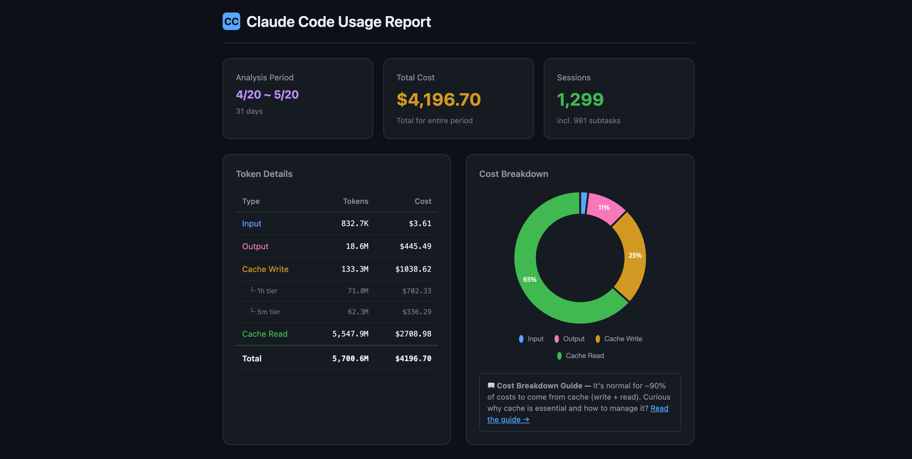

### 30초 요약

| 기능 | 설명 | 효과 |
| ------- | ------------ | ------ |
| 🧠 Session Architect | 무거운 작업을 SubTask로 자동 위임하고(캐시 쓰기 37.5% 저렴), 도구 호출을 묶어 왕복 횟수를 줄입니다 | 컨텍스트가 작아지고 왕복이 줄어 비용이 내려갑니다 |
| 🪶 Concise Mode | 응답의 군더더기만 빼고 내용은 그대로 둡니다 | 응답마다 출력 토큰이 줄어듭니다 |
| 🔄 /s-continue | /compact 대신 씁니다. LLM 호출 0, 비용 0, 정보 손실 0. **Codex** 세션도 복원합니다 | 두 도구 모두 컨텍스트를 공짜로 되살립니다 |
| 🤝 /s-compact | /s-continue가 자동으로 불러오는 인계 기록을 씁니다. 트랜스크립트에 안 남는 서브에이전트 발견과 도구 결과까지 담습니다 | 다음 세션이 숨은 맥락까지 이어받습니다 |
| 📊 Status Line | 비용·컨텍스트·요금 한도를 실시간으로 보여줍니다. 50ms 이하 | 비용이 터지기 전에 먼저 봅니다 |
| 📈 /usage-view | AI 분석이 붙은 인터랙티브 HTML 대시보드 | 클릭 한 번으로 비용 전체를 추적합니다 |
| ✂️ /setup-git-lite | 세션마다 몰래 들어가는 숨은 토큰 2,200개를 걷어냅니다 | git 지침만으로 월 ~$48 절감 |
| 🛡️ Token Guardian | 캐시 만료로 컨텍스트가 재전송되는 순간 알려주고, `block` 모드면 막아 줍니다 | 소리 없는 $9 청구가 사라집니다 |

---

## 😤 문제

**보이지 않는 비용.** 지금 얼마나 쓰고 있는지 알 방법이 없습니다. "컨텍스트가 800K입니다"라는 경고도, "3분 전에 캐시가 만료됐습니다"라는 알림도 없습니다. 돈이 나간 뒤에야 압니다.

**컨텍스트 비대.** 같은 프롬프트라도 컨텍스트가 200K일 때와 800K일 때 비용이 4배 차이 납니다. Read, Grep, Edit을 한 번 할 때마다 컨텍스트 전체가 다시 전송됩니다. 복잡한 프롬프트 하나가 API 호출 15회 이상을 만들고, 그 하나하나에 컨텍스트 크기가 곱해집니다.

**캐시 만료.** 점심 먹고 돌아오면 캐시가 사라져 있습니다. 다음 프롬프트 하나가 900K 토큰을 제값에 다시 보냅니다. 한 번에 $9입니다.

**전부 수동.** 컨텍스트 관리, 캐시 만료 타이밍, SubTask 위임, 세션 정리. 코딩하면서 이걸 다 챙기는 건 불가능합니다.

**Max Plan($200/월)이라면?** 위의 모든 문제에, 타이머도 예상 시각도 없이 작업을 끊는 5시간 요금 한도가 더해집니다.

**API 종량제라면?** 위의 모든 문제에, 상한선까지 없습니다. 캐시 미스 한 번이 실제 돈 $9입니다. 일주일에 열 번이면 사고만으로 월 $360입니다. 컨텍스트가 부풀어 오른 화요일 하루가 Max Plan 한 달치보다 비쌀 수 있습니다.

super-token-saver가 이 전부를 자동으로 처리합니다. **한 번 설치하면 끝입니다.**

---

## 🚀 설치

```
/plugin marketplace add ww-w-ai/marketplace
/plugin install super-token-saver@ww-w-ai
```

설치하면 바로 동작합니다. 설정할 것이 없습니다. [Claude Code](https://claude.ai/claude-code) v2.1.71 이상이 필요합니다.

실시간으로 보고 싶다면:

```
/setup-statusline install
```

CC 내장 git 지침의 숨은 토큰 2,200개를 걷어내려면 ([상세](#%EF%B8%8F-기능-4-setup-git-lite--cc-내장-git-지침-축소)):

```
/setup-git-lite install
```

---

## 🧠 기능 1: Smart Session Architecture

**설치만 하면 비용이 덜 드는 작업 방식이 자동으로 적용됩니다.**

대부분은 Main 세션에서 모든 일을 합니다. 파일 읽기, 코드 생성, 테스트 실행까지요. 그 결과물이 전부 컨텍스트에 쌓이고, 메시지를 보낼 때마다 다시 전송됩니다. 세션은 무거워지고 비용은 불어납니다.

Session Architect는 세션이 시작될 때 비용 전략 두 가지를 자동으로 넣어 줍니다.

**1. SubTask 위임.** 무거운 작업은 컨텍스트가 작고 캐시 티어가 싼 SubTask에서 돌립니다.

|                  | Main Session                      | SubTask                               |
| ---------------- | --------------------------------- | ------------------------------------- |
| 역할             | 설계, 의사결정, 검토              | 구현, 코드 생성, 여러 파일 편집       |
| Cache 티어       | 1시간 (ephemeral_1h)              | 5분                                   |
| Cache write 비용 | ＄10/MTok                          | ＄6.25/MTok                            |
| 컨텍스트 크기    | 평균 ~94K                         | 평균 ~33K                             |

**2. 왕복 줄이기.** 비용은 컨텍스트 크기 × 왕복 횟수이고, 왕복 한 번마다 대화 전체를 다시 읽습니다. 50K 컨텍스트에서 도구 호출 5개를 차례로 하면 cache read 250K 토큰입니다. 두 번의 왕복으로 묶으면 100K, **60% 절감에 결과는 같습니다.** 주입되는 규칙이 Claude에게 독립적인 도구 호출은 한 번에 묶고, 배치를 먼저 계획하고, 답이 나오면 바로 멈추고, SubTask가 자기 왕복을 안에서 흡수하게 합니다.

**결과:** 컨텍스트가 600K 넘게 불어나는 대신 250K 아래로 유지되고, 왕복도 줄어듭니다. 같은 일을 더 싸게 합니다. 전부 자동입니다.

---

## 🪶 Concise Mode

**내용은 그대로. 군더더기만 줄입니다. 기본으로 켜져 있습니다.**

SessionStart 훅이 응답 스타일 규칙을 **모든 세션, 모든 모델**에 넣어 줍니다. 따로 설정할 것은 없습니다. 세 가지가 달라집니다.

- **서두가 없어집니다.** "살펴볼게요…", "이제 하겠습니다…", 질문을 다시 읊는 말, diff에 이미 보이는 내용을 요약하는 말이 사라집니다.
- **내용에 맞는 형식을 씁니다.** 목록은 불릿으로, 트레이드오프나 인과관계 같은 추론은 산문으로 씁니다. 어느 한쪽을 강제하지 않습니다.
- **같은 요점을 더 적은 단어로 씁니다.** 명확하게 쓰면 짧아집니다.

선은 분명합니다. 내용을 빼거나, 검증을 건너뛰거나, 뉘앙스를 한 문장으로 뭉개는 것은 금지입니다. 내용은 그대로 두고 포장만 줄입니다.

한 번 설치하면 어디서나 적용됩니다.

---

## 🔄 기능 2: /s-continue — 컨텍스트 복원

**`/compact`가 필요 없습니다. LLM 호출 0번. 비용 $0. 사라지는 정보 0.**

`/compact`는 컨텍스트 전체(~1M 토큰)를 LLM에 보내서 3.3% 크기의 요약본으로 줄입니다. 캐시가 만료된 상태라면 이것만으로 전체 재캐시가 일어납니다. 정보 손실은 피할 수 없습니다.

`/s-continue`는 방식이 전혀 다릅니다. 이전 세션의 트랜스크립트를 전처리해서 그대로 불러옵니다. LLM 호출이 없으니 비용도 없습니다. 원래 대화가 그대로 돌아옵니다.

|                         | /compact                          | /s-continue                        |
| ----------------------- | --------------------------------- | -------------------------------- |
| 작동 방식               | 컨텍스트 전체를 LLM에 보내 요약   | 트랜스크립트를 전처리해 바로 로드 |
| LLM 호출                | 필요 (보통 100K 토큰 이상)        | 0                                |
| 토큰 비용               | 높음                              | 0                                |
| 정보 손실               | 있음 (3.3% 요약)                  | 없음 (원본 그대로)               |
| 처리 속도               | 수십 초                           | 1초 미만 (60MB 넘는 파일도)      |
| 캐시 만료 시            | 전체 재캐시 비용이 더 붙음        | 영향 없음                        |
| 여러 세션 복원          | 안 됨                             | 됨                               |

사용법: `/clear` 하고 `/s-continue`를 치면 이전 세션 목록이 나옵니다. 복원할 세션을 고르면 됩니다. 바로 복원하려면 `/s-continue last`.

**결과:** 이전 작업을 공짜로 이어갑니다. 정보 손실 없이, 60MB 넘는 트랜스크립트도 1초 안에 처리합니다.

### 🤝 짝을 이루는 기능: `/s-compact` — 숨은 층까지 넘겨줍니다

`/s-continue`는 트랜스크립트, 그러니까 여러분과 Claude가 나눈 대화를 복원합니다. 그런데 한 세션에서 가장 쓸모 있는 지식은 그 대화 밖에 있을 때가 많습니다. 서브에이전트가 찾아낸 것(트랜스크립트가 별도 파일이라 복원할 때 안 실립니다), 도구 출력 안에 있던 결정적인 숫자(테스트 개수, 벤치마크 수치), 일하면서 얻은 교훈("헤드리스에서 재현이 안 됐던 건 코드가 아니라 빌드 문제였다") 같은 것들입니다.

세션을 마칠 때 `/s-compact`를 실행하면 이 숨은 층을 인계 기록으로 정리해 `~/.claude/super-token-saver-data/<project>/handoff.md`에 저장합니다. 다음 세션에서 `/s-continue`가 복원한 트랜스크립트 위에 이 기록을 자동으로 얹어 줍니다. 따로 붙여 넣을 필요가 없습니다.

|                     | `/s-continue` 단독            | `/s-compact` + `/s-continue` (세트)          |
| ------------------- | ----------------------------- | --------------------------------------------- |
| 복원 범위           | 트랜스크립트(나눈 대화)       | 트랜스크립트 + 숨은 층                        |
| 서브에이전트 발견   | 사라짐(별도 파일)             | 인계 기록에 정리되어 남음                     |
| 도구 출력의 숫자    | 대화에서 직접 언급된 것만     | 일부러 뽑아서 기록                            |
| 일하면서 얻은 교훈  | 없음                          | 같은 막다른 길을 다시 가지 않도록 기록        |

**작업 흐름:** 세션을 `/s-compact`로 마치고, 다음 세션을 `/s-continue`로 시작하세요.

### 🔀 Claude Code에서 하던 일을 Codex에서 이어 하고, 다시 돌아옵니다

Claude Code와 Codex는 서로의 대화 기록을 읽지 못합니다. Claude Code는 `~/.claude/projects/`에, Codex는 `~/.codex/sessions/`에 따로 쓰기 때문입니다. `/s-continue`는 이 둘을 한꺼번에 읽습니다. `/s-compact`로 만든 인계 파일도 프로젝트 단위로 공유됩니다. 그래서 Claude Code로 시작한 스프린트를 Codex에서 이어 하고, 다시 Claude Code로 돌아와도 맥락이 끊기지 않습니다. 한쪽 예산이 바닥나면 다른 쪽에서 그 자리부터 계속하면 됩니다. **두 도구의 기록을 함께 복원하는 플러그인은 이것뿐입니다.**

속도도 문제없습니다. Codex 기록은 별도 파서를 거치지 않고 Claude Code가 쓰는 형식으로 **줄 대 줄** 변환됩니다. 파이프라인 하나가 양쪽을 처리하고, `L{n}` 마커는 원본 Codex 파일의 그 줄을 그대로 가리킵니다. 12 MB, 1,540줄짜리 기록도 **0.13초**면 끝납니다.

**auto-compact가 일어나도 대화는 이어집니다.** Claude Code가 스스로 컨텍스트를 압축하면, 플러그인의 after-compact 훅이 압축 직전 대화(사용자 발화와 Claude 응답)를 기록에서 꺼내 다시 넣어 줍니다. 요약이 아니라 원문이고, 빠지는 구간이 없습니다. Codex의 압축과 스레드 롤백도 같은 방식으로 되살립니다.

|                        | Claude Code 세션 | Codex 세션 |
| ---------------------- | ------------------- | ------------- |
| `/s-continue` 목록에 표시 | O | O, 현재 프로젝트 범위로 |
| LLM 비용 0으로 복원 | O | O |
| `L{n}`으로 원본 위치 찾기 | O | O — 줄 번호는 rollout 파일 자체의 것 |
| 컨텍스트 손실(`#0`) 복원 | `/compact`, auto-compact | Codex의 압축과 스레드 롤백 |
| `/s-compact` 인계 기록 | 프로젝트 단위로 공유 — 한 도구에서 쓰고 다른 도구에서 불러옵니다 |

```
/s-continue codex                    only Codex sessions
/s-continue codex : rust migration   the turns matching a topic, restored in full
```

목록이 맞게 나오느냐, 그럴듯하지만 틀리게 나오느냐는 두 가지에 달려 있습니다. 첫째, Codex의 `session_id`는 **스레드** id라서 서브에이전트가 그대로 물려받습니다. 그래서 세션은 `payload.id`로 구분하고, 서브에이전트의 rollout은 Claude Code의 subtask 트랜스크립트를 걸러내는 것과 같은 방식으로 뺍니다. 둘째, `<codex_internal_context source="goal">`는 시스템이 넣은 것이라 복원된 컨텍스트에는 남기되 사용자가 친 턴으로는 세지 않습니다.

이 플러그인은 Codex에도 설치됩니다. **[README-CODEX.md](./README-CODEX.md)** ([한국어](./README-CODEX.ko.md) · [日本語](./README-CODEX.ja.md) · [简体中文](./README-CODEX.zh-Hans.md))를 보세요. `usage-view`도 Codex 세션을 읽습니다. 비용은 구매 크레딧으로 환산해 보여줍니다. `report-limit`과 `setup-statusline`은 아직 Claude Code 전용입니다.

---

## 📊 기능 3: 실시간 Status Line

**토큰과 비용을 실시간으로. 오버헤드는 50ms 이하.**

`/setup-statusline install`을 한 번 실행하면 Claude Code 아래쪽에 상태 표시줄이 붙습니다.

**평소 상태.** 화면을 옮기지 않고 모든 지표를 한눈에 봅니다.

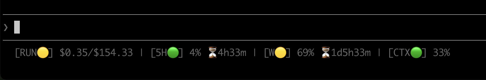

**요금 한도에 걸렸을 때.** 5H가 102%에서 빨갛게 바뀌고, 풀릴 때까지 남은 시간이 정확히 카운트다운되며, `/report-limit` 안내가 자동으로 올라옵니다.

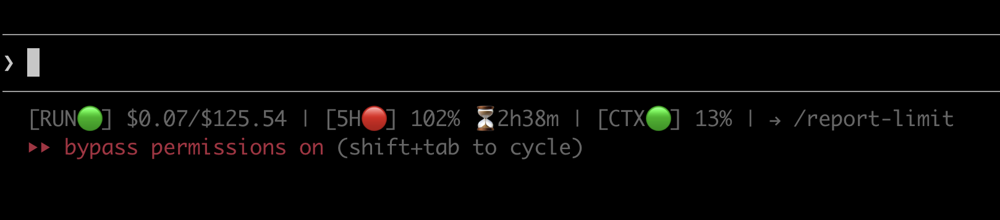

| 지표              | 표시 내용                           | 🟢 정상   | 🟡 경고    | 🔴 위험     |
| ---------------- | ----------------------------------- | --------- | ---------- | ----------- |
| RUN (증분)       | 마지막 API 호출 비용                | < ＄0.30   | >= ＄0.30   | >= ＄1.00    |
| RUN (누적)       | 이 폴더의 누적 비용                 | —         | —          | —           |
| 5H               | 5시간 윈도우 사용량 + 리셋 카운트다운 | < 70%     | >= 70%     | >= 90%      |
| CTX              | 컨텍스트 윈도우 사용량              | < 35%     | >= 35%     | >= 70%      |

지표 중 하나라도 경고나 위험에 들어가면 `→ /usage-view current` 안내가 자동으로 뜹니다.

지우려면 `/setup-statusline uninstall`. 이전 설정이 자동으로 돌아옵니다.

**결과:** 비용 문제를 실시간으로 봅니다. 오버헤드는 50ms 이하라 느려지는 느낌이 없습니다.

> **API 종량제라면?** 5H와 W 지표는 자동으로 숨깁니다. 요금 한도 윈도우가 없으니까요. 남는 건 중요한 것 둘뿐입니다. RUN(턴마다 실시간 비용)과 CTX(컨텍스트 크기). 청구서를 정하는 이 두 가지가 항상 보입니다.

---

## 📈 사용 대시보드 (/usage-view)

**"그 돈이 다 어디 갔지?"에 드디어 답이 나옵니다.**

Max Plan 사용자는 요금 한도에 걸리고 나서 왜인지 궁금해합니다. API 사용자는 Anthropic 청구서를 열고 어쩌다 이렇게 됐는지 궁금해합니다. 어느 쪽이든 질문은 같습니다. 어느 세션이 토큰을 제일 많이 썼나? 언제 비용이 튀었나? 내 사용 패턴은 어떤가? 지금까지는 어느 것도 볼 수 없었습니다.

`/usage-view`가 전부 보여줍니다. 브라우저에 인터랙티브 HTML 대시보드가 열리고, 사용 패턴을 분석하고 비용이 튄 원인을 따라갈 수 있습니다. 외부 의존성이 없고, 혼자 동작하고, 파일 하나라 공유할 수 있습니다.

**31일 동안 $4,196. 어디에 썼을까요?** 총 비용, 유형별 토큰, 캐시 효율, 세션 수가 한눈에 보입니다. 도넛 차트를 보면 지출의 65%가 cache read라는 걸 바로 알 수 있습니다. 이건 정상이고 건강한 상태입니다.


**설치 전후 비교. 추측이 아니라 실측입니다.** 주황색 점선 "Plugin installed" 표시가 비용 타임라인을 둘로 나눕니다. 일별 막대는 토큰 유형(Input/Output/Cache Write/Cache Read)별로 쌓여 있어서, 설치 뒤에 어느 항목이 달라졌는지 정확히 보입니다. 평균선이 추세를 보여줍니다.

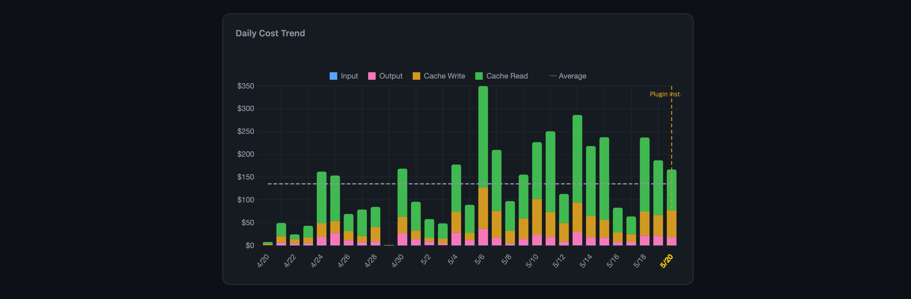

**언제 제일 많이 쓸까요?** 시간대별 비용과 요일별 분포입니다. 활성일 평균, 전체 일 평균, 최대값으로 바꿔 볼 수 있습니다. 불꽃 아이콘이 가장 비싼 시간을 표시하니, 늦은 밤 몰아치기나 수요일 급등 같은 패턴이 바로 보입니다.

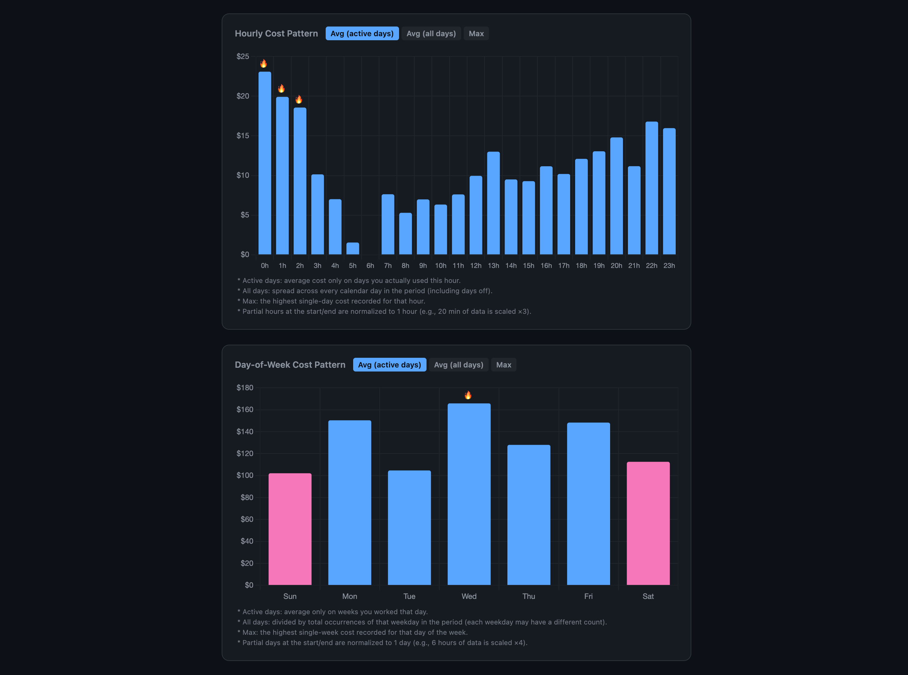

**효율이 좋아지고 있나요?** Total/Output 비율은 출력 토큰 하나를 만드는 데 토큰을 몇 개 쓰는지 잽니다. 낮을수록 좋습니다. "Plugin installed" 표시로 전후를 비교할 수 있습니다. 갑자기 튀면 캐시 미스이거나 세션을 새로 시작한 겁니다.

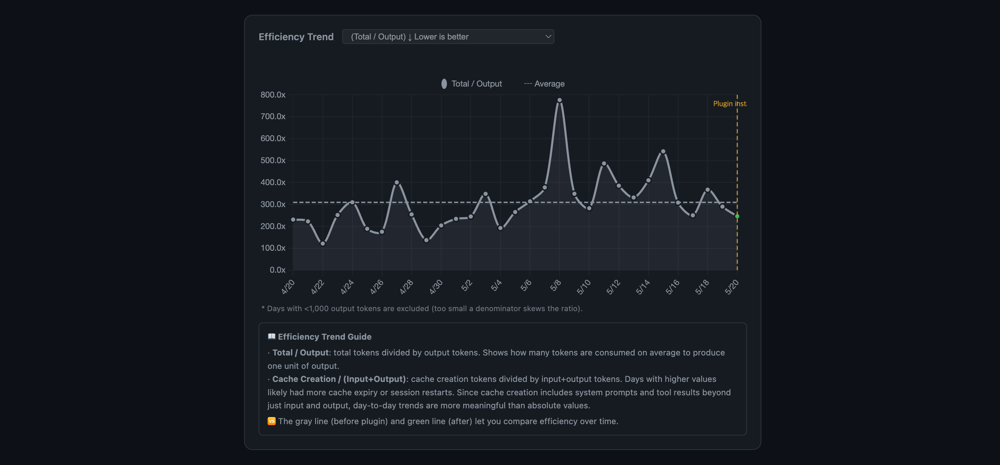

**API 호출 하나하나를 컨텍스트 크기와 비용으로 찍었습니다.** 비용 구조가 직관적으로 보이는 차트입니다. 점 하나가 API 호출 하나입니다. 빨간색은 Opus, 파란색은 Sonnet, 초록색은 Haiku. 점선이 이론상 가격이고, 점이 그 위에 있으면 더 낸 겁니다. **User Turn** 보기로 바꾸면 API 호출이 아니라 대화 턴 단위 비용이 나옵니다.
점에 마우스를 올리면 실제 프롬프트 텍스트, 토큰 수, 비용 내역(Input/Output/Cache Write/Cache Read)이 보입니다.

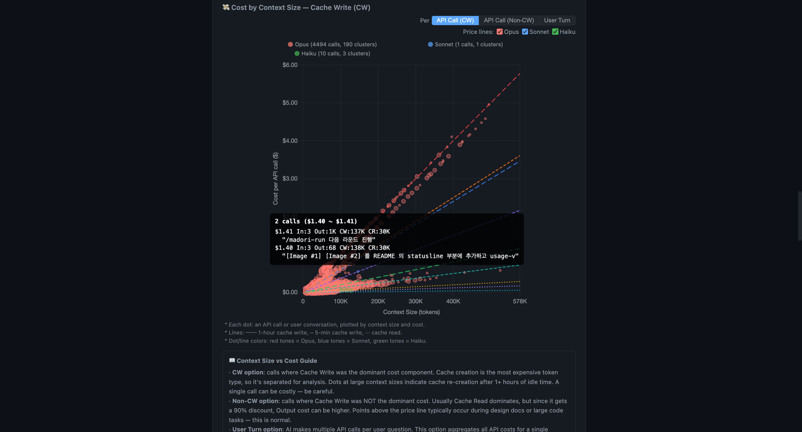

**컨텍스트가 얼마나 큰가요?** 대부분의 호출은 250K 아래에 모여 있습니다. 350K 위로 길게 늘어진 꼬리가 비용이 터지는 구간입니다. 이 차트로 그 구간에 얼마나 자주 들어가는지 정확히 알 수 있습니다.

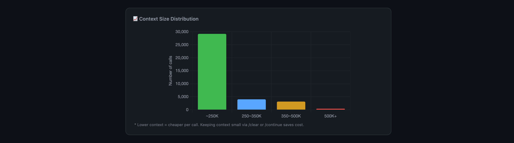

**시간마다 값이 붙은 코딩 달력.** 30일치 5시간 윈도우 히트맵입니다. 초록색은 시간당 $15 미만, 주황색은 $15~30, 빨간색은 $30 이상. 해골 아이콘(💀)은 요금 한도에 걸린 윈도우입니다. 위쪽 비용 슬라이더로 싼 윈도우를 걸러내면 비싼 날이 바로 나옵니다. 5시간 윈도우 보기와 1시간 블록 보기를 오갈 수 있습니다.

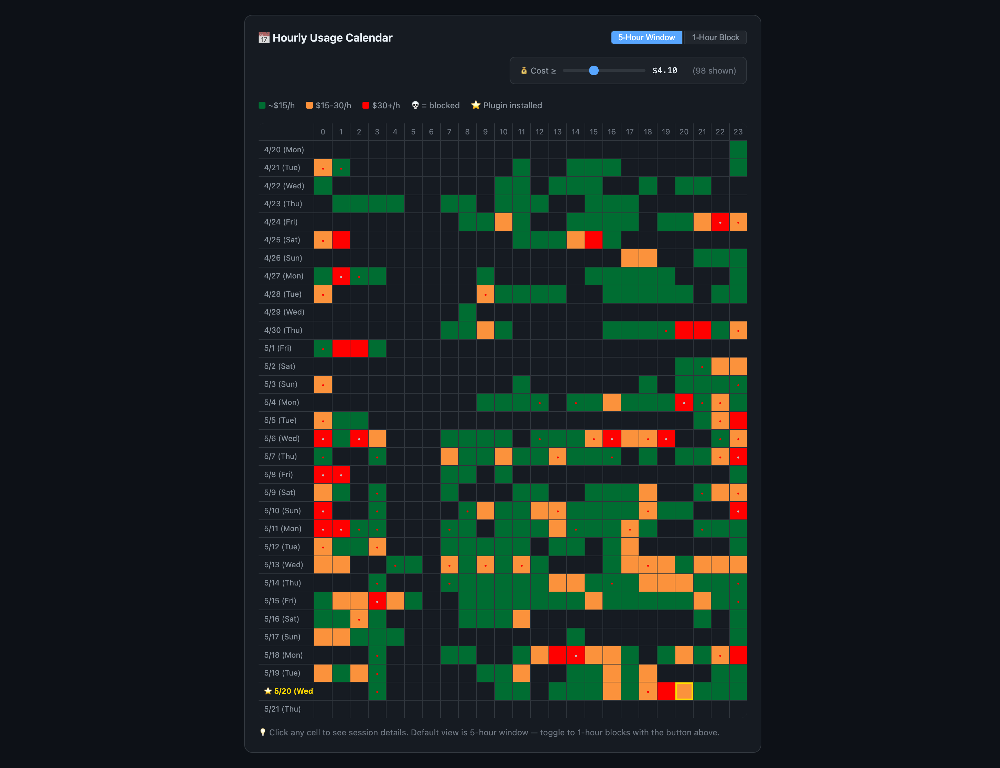

**칸을 클릭하면 그 윈도우의 세션으로 들어갑니다.** 그 시간대의 모든 세션과 비용, 메시지 수, 토큰 내역, 각 대화의 실제 첫 메시지와 마지막 메시지가 나옵니다. "Top Token Conversations"를 펼치면 어느 대화가 제일 많이 썼는지 보입니다. 항목마다 프롬프트 텍스트, 비용 경고 태그, 최적화 힌트가 붙어 있습니다.

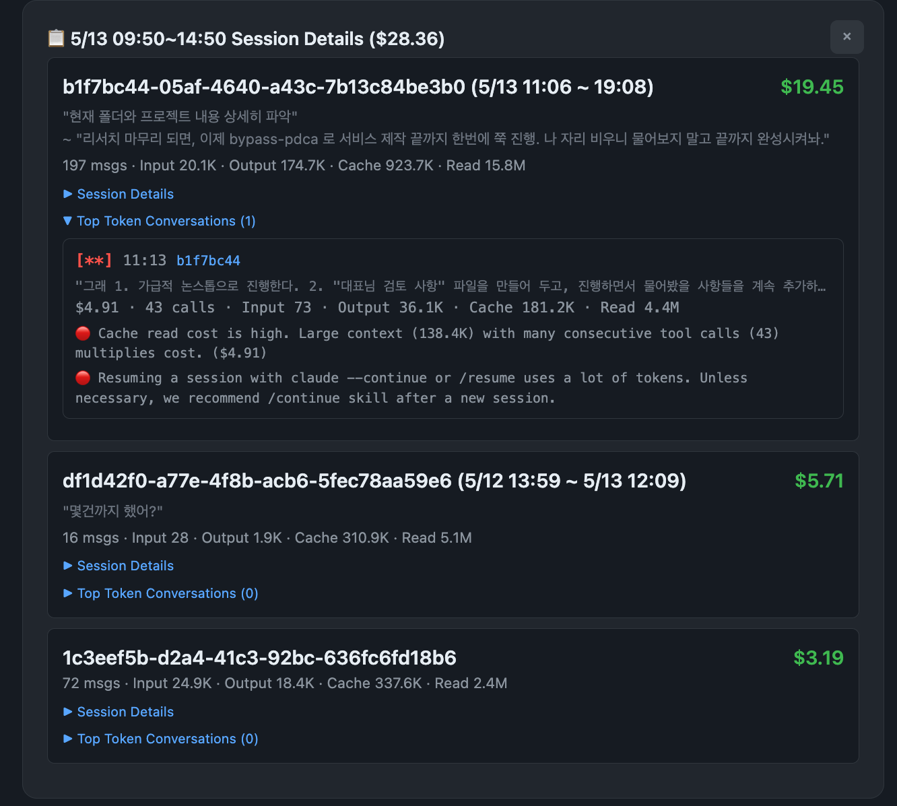

**AI 분석 (선택).** `--no-ai` 없이 `/usage-view`를 실행하면 AI 애널리스트가 API 가격표가 포함된 대시보드 데이터 전체를 읽고 보고서를 씁니다. 비용을 끌어올린 원인, 이상한 패턴, 최적화 권고가 담깁니다. OS 언어로 자동 표시됩니다(23개 언어, RTL 포함. 차트와 표는 항상 LTR).

**돈이 어디 갔는지.** 총 지출, 토큰 유형별 비용 원인, 주간 추세, 실제 수치로 잰 플러그인 효과:

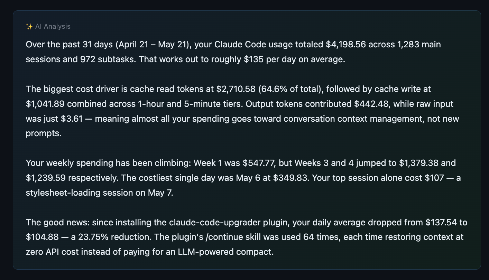

**언제, 어떻게 일하는지.** 피크 시간, 가장 바쁜 날, API 호출 분포, 최적화 여지를 드러내는 요금 한도 패턴:

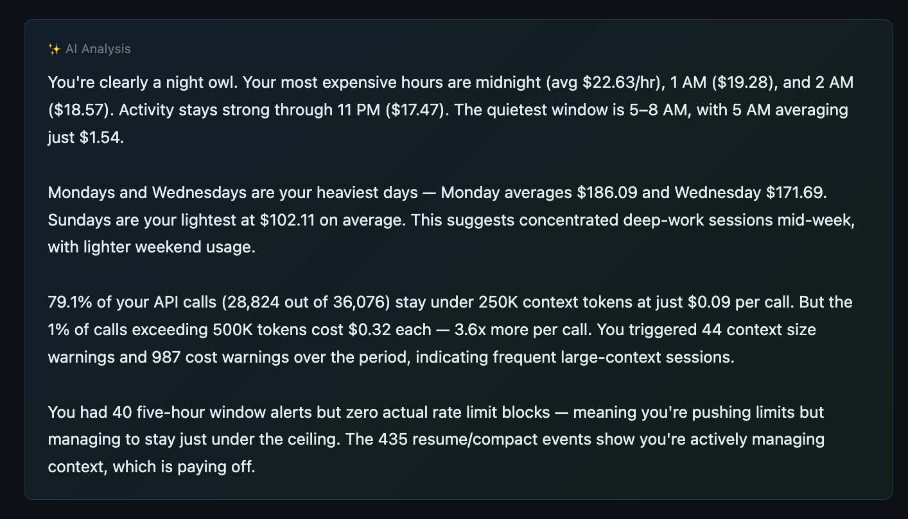

**무엇을 해야 하는지.** 실제 사용량에 맞춘 구체적인 권고. 모델 전환, 컨텍스트 관리, 세션 전략:

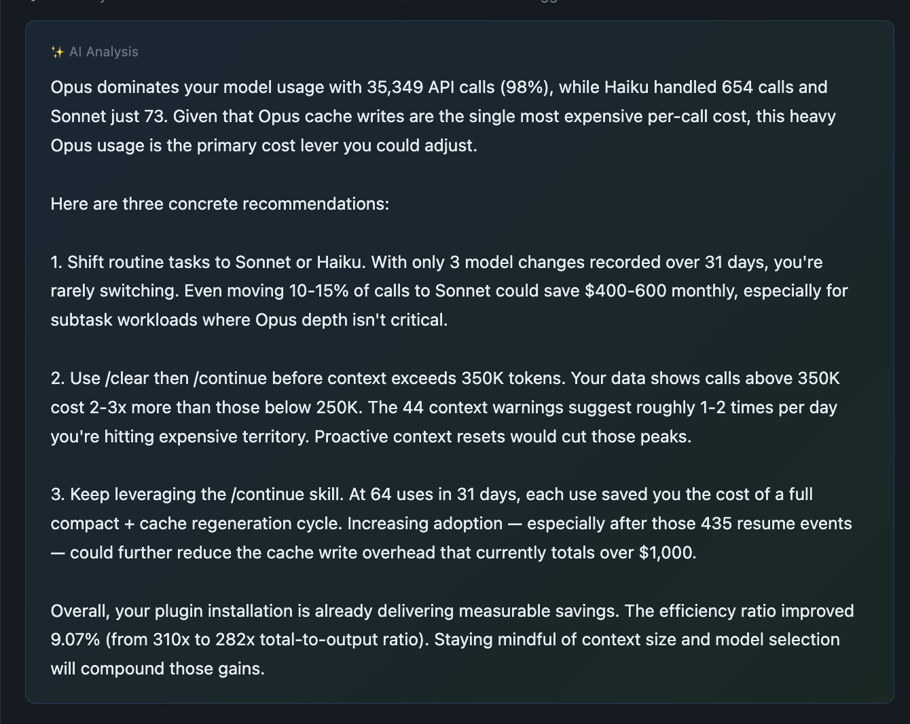

**공유하세요.** 대시보드 전체가 HTML 파일 하나입니다. 데이터가 안에 다 들어 있어서 서버가 필요 없습니다. 팀원, 관리자, 회계 담당자에게 그냥 보내면 됩니다. 외부 의존성 없이 오프라인에서도 열립니다. `private` 모드로 만들면 프롬프트 텍스트를 빼고 공유할 수 있습니다. 비용 분석은 그대로 두고 대화 내용만 지웁니다.

```
/usage-view                  # 전체 기간, 전체 프로젝트
/usage-view current          # 현재 5시간 윈도우만
/usage-view last 7 days      # 최근 7일
/usage-view locale ja        # 일본어
/usage-view --no-ai          # AI 분석 건너뜀 (빠름)
/usage-view private          # 프롬프트 텍스트 제거 (공유 안전)
```

---

## 🔬 요금 한도 연구 (/report-limit)

**요금 한도 공식을 거꾸로 알아내는 커뮤니티 프로젝트입니다.**

Anthropic은 5시간 윈도우의 정확한 공식을 공개하지 않습니다. 같이 알아봅시다.

요금 한도에 걸리면 `/report-limit`을 실행하세요. 지금 사용 데이터가 GitHub Discussion에 자동으로 올라갑니다. 데이터가 쌓일수록 공식이 또렷해집니다.

---

## ✂️ 기능 4: /setup-git-lite — CC 내장 Git 지침 축소

**소스를 뜯어 보니 있었습니다. 세션마다 몰래 끼워 넣어지는 토큰 2,200개. 모르는 사이에 돈을 내고 있었던 겁니다.**

### 발견 경위

2026-04-12, [GitHub 이슈](https://github.com/anthropics/claude-code/issues/47107)에서 Claude Code의 내장 `includeGitInstructions` 설정이 세션마다 토큰을 소모한다는 사실이 알려졌습니다. [spilist의 gist](https://gist.github.com/spilist/b0db92a859192f5ec6199d3f35a81b98)로 따로 재현해 수치를 확인했습니다. git 커밋 뒤 세션당 **cache write +6,031 토큰**, 모든 API 호출에서 **cache read +1,690 토큰**입니다.

### CC 소스 분석 — 토큰이 어디로 가는가

Claude Code 소스(v2.1.88)를 따라가 보니 토큰이 들어가는 지점이 두 군데였습니다.

**1. `gitStatus` 스냅샷 (~500 tok) — 시스템 프롬프트**
- `context.ts:36-111`의 `getGitStatus()`가 브랜치, 메인 브랜치, user.name, 전체 상태(최대 2000자), **최근 커밋 5개**를 모읍니다
- `appendSystemContext`(`utils/api.ts:437`)를 거쳐 시스템 프롬프트에 붙습니다
- 새 커밋, 새로 수정한 파일, 브랜치 전환 때마다 텍스트가 바뀌어 프리픽스 캐시가 무효화됩니다

**2. 커밋/PR 워크플로 지침 (~1,700 tok) — Bash 도구 설명**
- `tools/BashTool/prompt.ts:53`이 60줄 넘는 안전 규칙, 단계별 커밋 절차, HEREDOC 예제, PR 생성 템플릿을 `Bash` 도구 설명에 붙입니다
- 시스템 프롬프트와 함께 캐시되지만 `tools[]` 파라미터로 전달됩니다

### 왜 비싼가

캐시 구조(`utils/api.ts:321` `splitSysPromptPrefix`)는 MCP 도구가 켜져 있는지에 따라 세 가지 경로로 갈립니다.

- **Path A** (MCP 켜짐, 대부분의 사용자): `gitStatus`가 `cacheScope: 'org'` 블록 안에 들어갑니다. 내용이 바뀌면 다음 세션 시작 때 블록 전체를 다시 캐시합니다. 6K tok `cache_create` 미스입니다.
- **Path B** (MCP 없음): `gitStatus`가 `cacheScope: null` 동적 블록으로 옮겨 가서, 모든 API 호출마다 새 `input_tokens`로 다시 보냅니다. 캐시 미스는 없지만 캐시로 아끼는 것도 없습니다.
- **Path C** (외부 프로바이더 / 실험 베타 꺼짐): Path A와 같습니다.

보통의 대화형 세션에서 커밋/PR 지침(1.7K tok)은 `cache_read`로 **모든 API 호출에 쌓입니다.** Opus 4.7 가격으로 100회 호출 세션이면, Claude가 학습으로 이미 아는 지침에 **세션당 ~$0.08**을 씁니다.

### super-token-saver의 처리 방식

`/setup-git-lite`는 내장 경로를 끄고, SessionStart 훅으로 **280 토큰짜리 대체 지침**을 넣습니다. Claude의 기본 성향을 바꿔야 하는 것(안전 규칙)만 남기고, Claude가 학습으로 이미 아는 것(단계별 워크플로, PR 템플릿, gh 사용법)은 뺐습니다.

**남긴 것 — 핵심 규칙 11개** (Claude의 기본 "도와주려는" 성향을 조심하는 쪽으로 바꾸는 규칙들):
- 사용자가 명시적으로 시키지 않으면 커밋/push/amend/PR/tag/merge 금지
- 훅 건너뛰기, main/master 강제 push, 파괴적 작업, git 설정 수정 금지
- `.env`, `credentials`, `*.pem`, `secret.*`에 해당하는 파일 커밋 금지
- `git add -A` / `git add .` 금지
- 여러 줄 커밋 메시지는 HEREDOC으로, `Co-Authored-By: Claude` 트레일러 추가
- 대화형 플래그(-i) 금지, 빈 커밋 금지
- pre-commit 훅이 실패하면 새 커밋을 만들 것(`--amend` 금지)

**뺀 것.** 단계별 커밋 워크플로(3단계), 단계별 PR 워크플로(3단계), PR 제목/본문 템플릿, `gh` 명령 참조, `-uall` 플래그 경고, rebase와 함께 쓰는 `--no-edit` 경고, `커밋 중 TodoWrite나 Agent 도구 절대 금지` 제약. Claude가 학습만으로 제대로 처리하는 세부 절차들입니다.

**더한 것.** 짧은 git 상태 한 줄. 브랜치, HEAD short-sha와 제목, 현재 상태(수정 파일 최대 20개, 넘으면 개수만). 최근 커밋 목록은 없습니다. 필요하면 Claude가 `git log`를 직접 치면 됩니다.

### 예상 절감액 (Opus 4.7 가격, output $25/MTok, input $5/MTok, cache read $0.50/MTok)

| 항목 | 원본 | setup-git-lite 적용 후 | 절감 |
| ---- | -------- | ------------------- | ----- |
| 시스템 프롬프트 로드 (새 세션당) | ~2,200 tok cache_create | ~280 tok cache_create | ~1,920 tok |
| 같은 세션 안의 반복 호출 | ~1,700 tok cache_read/call | ~280 tok cache_read/call | ~1,420 tok/call |
| 100회 호출 세션 (Opus 4.7) | — | — | **~$0.11 절감** |
| 하루 20세션 × 22 근무일 | — | — | **월 ~$48 절감** |

### 사용법

```bash
/setup-git-lite status     # 읽기 전용 진단 — 현재 상태 + 바뀔 내용
/setup-git-lite install    # CC 내장 지침 끄기 + 최소 훅 켜기
/setup-git-lite revert     # 기본값 복원 (강력함, 아래 참고)
/setup-git-lite dismiss-banner    # 가끔 뜨는 추천 팁 숨기기
/setup-git-lite undismiss-banner  # 팁 다시 켜기
/setup-git-lite help       # 전체 사용법
```

### 설치 동작

`install`은 확실하게 하려고 **두 곳**을 고칩니다.

1. `~/.claude/settings.json`에 `"includeGitInstructions": false`를 추가합니다
2. 셸 프로파일(`~/.zshrc`, `~/.bashrc` 등)에 `CLAUDE_CODE_DISABLE_GIT_INSTRUCTIONS=1`을 export하는 마커 블록을 추가합니다

둘 중 하나만 있어도 CC 내장 지침은 꺼집니다. 그래도 둘 다 설정하는 이유는, 환경 변수가 실수로 내장 동작을 다시 켜는 일을 막기 위해서입니다. 셸 변경은 새 셸부터 적용됩니다.

### revert 동작 — 강력함

`revert`는 **셸 프로파일에서 `CLAUDE_CODE_DISABLE_GIT_INSTRUCTIONS` export를 전부 지웁니다.** 이 스킬을 설치하기 전에 직접 넣어 둔 것도 포함됩니다. 의도된 동작입니다. `revert`를 실행했으니 깨끗한 기본값으로 되돌리는 겁니다. 셸 프로파일은 항상 먼저 타임스탬프 백업을 만듭니다.

다른 이유로 그 환경 변수가 필요하다면 `revert` 전에 적어 두고 나중에 다시 넣으세요.

### super-token-saver 제거 전

**먼저 `/setup-git-lite revert`를 실행하세요.** 안 그러면 settings.json에 `includeGitInstructions: false`만 남고 대체 훅은 없는 상태가 됩니다. Claude가 git 지침을 아예 못 받게 됩니다. Claude Code에 플러그인 제거 시점의 훅이 아직 없어서 자동으로 해 드릴 수 없습니다.

### 트레이드오프

잃는 것, 그리고 대부분 괜찮은 이유:
- 세션 시작 때 미리 계산된 `git status` / `git log -n 5`를 Claude가 받지 않습니다. 새 세션에서 "뭐가 바뀌었어?"라고 물으면 Claude가 그 명령을 직접 실행합니다. 도구 호출 1회, ~300 tok이 더 듭니다.
- CC의 공식 3단계 커밋 절차를 받지 않습니다. 커밋 흐름을 수백 번 테스트해 본 결과, 중요한 것(HEREDOC 형식, `--amend` 금지, 강제 push 금지)은 명시 규칙으로 남겨 두었기 때문에 학습된 지식으로 충분했습니다.
- PR 본문 템플릿(`## Summary` + `## Test plan`)이 들어가지 않습니다. 그 형식이 꼭 필요하면 프로젝트 CLAUDE.md에 넣으세요.

### 추천 배너

CC 내장 git 지침이 아직 켜져 있으면, super-token-saver가 세션 시작 때 **~20% 확률**로 한 단락짜리 팁을 보여줍니다(`/usage-view`와 `/report-limit` 출력에도 들어갑니다). `/setup-git-lite dismiss-banner`로 완전히 숨길 수 있습니다.

---

## 🛡️ 기능 5: Token Guardian

**캐시 만료로 돈이 나가는 순간을 알려줍니다. 원하면 $9짜리 재전송을 막아 주기도 합니다.**

Claude Code의 프롬프트 캐시는 1시간 뒤에 만료됩니다. 한 시간 넘게 자리를 비우면 캐시가 없어지고, 다음 메시지를 보내는 순간 컨텍스트 전체가 제값에 다시 전송됩니다. 900K 토큰이면 한 번에 $9입니다.

Token Guardian은 마지막 응답을 받은 시각을 기억합니다. 3,590초(만료 시간에서 10초 여유를 뺀 값)가 지났으면 나설 수 있습니다. **기본은 꺼져 있습니다. 원격 제어(Remote Control) 때문입니다.** 훅의 차단 메시지는 로컬 시스템 메시지로만 그려지고 원격 화면에는 전달되지 않아서, 원격에서는 보낸 프롬프트가 아무 설명 없이 사라진 것처럼 보였습니다. 어디서 쓰느냐에 따라 다르게 동작하는 기능을 켜 두느니 꺼 두기로 했습니다. 원격 제어가 훅 메시지도 보여주게 되면 기본값을 다시 켭니다. 그전까지는 둘 중 하나를 골라 직접 켭니다.

```
export CC_TOKEN_SAVER_CACHE_GUARD=warn    # Claude가 답변 첫 줄에서 만료를 알림
export CC_TOKEN_SAVER_CACHE_GUARD=block   # 아래 메시지와 함께 프롬프트를 한 번 거부
```

`warn`은 프롬프트를 그대로 통과시키고, Claude가 답변 첫 줄에 "캐시가 만료돼 이 턴은 컨텍스트 전체 값을 치렀다, 한 시간 넘게 쉬었다 올 땐 `/clear` → `/s-continue`가 싸다"고 한 줄 알립니다. 이 모드는 원격에서도 보입니다. 훅 메시지는 안 가지만 Claude의 답변은 전달되기 때문입니다.

`block`은 아래 메시지와 함께 프롬프트를 한 번 거부합니다. 같은 프롬프트를 다시 보내면 통과합니다. 로컬 터미널에서 확실히 막고 싶을 때 씁니다.

```
🚨 Cache expired (68m 23s idle)

The prompt cache has expired. Continuing will resend the full context.
Cost may increase significantly.

👉 /context — Check current context usage before deciding
👉 /clear → /s-continue — Reset, then restore previous context (recommended, cheapest)
👉 Re-send — Continue as-is (full re-cache cost incurred)
```

차단 메시지는 OS 언어에 맞춰 23개 언어로 나오고, 자리를 비운 한 번에 한 번만 뜹니다.

**백그라운드 에이전트는 절대 막지 않습니다.** 검사는 사람이 직접 친 프롬프트에만 붙습니다. 백그라운드 에이전트나 태스크의 완료 보고는 요즘 한 시간 넘게 걸려 도착하는 일이 흔한데, 이건 그대로 통과시킵니다. 오래 걸린 에이전트의 결과가 막히거나 사라지는 일은 없습니다.

**결과:** warn 모드에서는 $9 재전송이 언제 왜 일어났는지 항상 알게 됩니다. block 모드에서는 아예 안 일어납니다. 한 번 잡을 때마다 $9, 하루 한 번이면 월 $270입니다.

> **API 종량제라면 타격이 더 큽니다.** Max Plan 사용자는 $200 안에서 $9를 잃습니다. 종량제 사용자는 실제 돈 $9를 잃습니다. 소리 없이, 자리를 비울 때마다요. block 모드가 그때마다 막습니다.

---

## 💡 캐시가 실제로 작동하는 방식 (그리고 대부분이 40% 넘게 낭비하는 이유)

Claude Code는 API 호출마다 대화 기록 전체를 모델에 보냅니다. 여기서 "API 호출"은 "내가 친 메시지 하나"가 아닙니다. 프롬프트 하나가 Grep, Read, Edit, Write 같은 도구 호출을 만들고, 그 하나하나가 별도의 API 호출입니다. 프롬프트 하나에 API 호출 10회는 쉽게 넘습니다.

프롬프트 캐시가 이 비용을 90% 줄여줍니다. 다만 캐시에는 수명이 있습니다.

|                     | Main Session                          | SubTask                                |
| ------------------- | ------------------------------------- | -------------------------------------- |
| Cache TTL           | 1시간 (ephemeral_1h)                  | 5분                                    |
| Cache write         | ＄10/MTok                              | ＄6.25/MTok                             |
| Cache read          | ＄0.50/MTok                            | ＄0.50/MTok                             |
| 캐시 만료 시        | 컨텍스트 전체를 제값에 다시 전송      | 영향 적음 (컨텍스트가 작음)            |

캐시가 살아 있어도 비용은 쌓입니다. 차이를 보여주려고 극단적인 시나리오를 잡았습니다.

### 시나리오: 하루 종일 코딩 (오전 3시간 → 점심/회의 2시간 → 오후 3시간)

조건: Opus 4 가격, 분당 프롬프트 1개, 프롬프트당 API 호출 ~5회(시간당 ~300회).

#### ❌ super-token-saver 없이

대부분의 작업이 Main 세션에서 일어납니다. 컨텍스트가 빠르게 불어납니다.

| 구간        | 상황                              | 컨텍스트 크기               | 비용                                   |
| ----------- | --------------------------------- | -------------------------- | -------------------------------------- |
| 오전 3시간  | 코딩 (주로 Main에서)              | 100K → 600K (평균 350K)    | 900회 × 350K × ＄0.50/M = ＄157.50  |
| 점심/회의   | 2시간 자리 비움                   | —                          | —                                      |
| 복귀        | 캐시 만료 → 전체 재전송           | 600K 제값                  | 600K × ＄5/M + 600K × ＄10/M = ＄9       |
| 복귀        | /compact (요약)                   | 600K → LLM에 전송          | 600K × ＄0.50/M + 요약 출력 = ~＄1.50 |
| 오후 3시간  | 코딩 계속 (컨텍스트 다시 증가)    | 100K → 600K (평균 350K)   | 900회 × 350K × ＄0.50/M = ＄157.50  |
|             | 합계                              |                            | ~＄326                                  |

> 이 정도 쓰면 5시간 윈도우 요금 한도에 걸릴 가능성이 높습니다. **비용도 문제지만 진짜 문제는 작업이 아예 멈춘다는 겁니다. 그 순간 Claude Code는 먹통이 됩니다.**

#### ✅ super-token-saver와 함께

무거운 작업은 SubTask에 넘깁니다. Main은 설계와 의사결정만 합니다.

| 구간        | 상황                                         | 컨텍스트 크기                | 비용                               |
| ----------- | -------------------------------------------- | --------------------------- | ---------------------------------- |
| 오전 3시간  | 코딩 (Main: 설계, SubTask: 구현)             | Main 100K → 300K (평균 200K) | 900회 × 200K × ＄0.50/M = ＄90 |
| 점심/회의   | 2시간 자리 비움                              | —                           | —                                  |
| 복귀        | ⚡ Token Guardian(block 모드) → /clear + /s-continue | —                           | ＄0 (LLM 호출 없음)                 |
| 오후 3시간  | 코딩 계속                                    | Main 100K → 300K (평균 200K) | 900회 × 200K × ＄0.50/M = ＄90 |
|             | 합계                                         |                             | ~＄180                              |

#### 💰 결과

> **＄326 → ＄180. 하루 ＄146 절약. 45% 절감.**
>
> **Max Plan:** 토큰을 덜 쓰니 요금 한도에 안 걸립니다. 작업이 안 멈춥니다. 이게 진짜 차이입니다.
>
> **API 종량제:** ＄146/일 × 22 근무일이면 **청구서에서 월 ＄3,200이 빠집니다.** 이 플러그인 없이 많이 쓴 달은 ＄7,000을 넘고, 있으면 ＄4,000 아래입니다. 결과물은 같습니다.

### super-token-saver가 끼어드는 지점

```
[세션 시작]
    │
    ├─ Session Architect → SubTask 위임 패턴 자동 주입
    │                       Main 컨텍스트를 250K 이하로 유지
    │
[작업 중]
    │
    ├─ Status Line → 비용/컨텍스트/요금 한도를 실시간으로 표시
    │                  경고 구간에 들어가면 바로 알림
    │
[1시간 이상 유휴]
    │
    ├─ Token Guardian → 캐시 만료 감지, 경고 (block 모드면 차단)
    │
[세션 재시작]
    │
    └─ /s-continue → 비용 0으로 이전 컨텍스트 복원 (LLM 호출 없음)
```

---

## 🔧 소스 설치 및 커스터마이징

```bash
git clone https://github.com/ww-w-ai/super-token-saver.git
/plugin marketplace add /path/to/super-token-saver
/plugin install super-token-saver@ww-w-ai
```

super-token-saver는 오픈소스(Apache-2.0)입니다. 순수 JavaScript와 Bash로만 되어 있고, 컴파일된 바이너리도, 외부 API 호출도, 텔레메트리도 없습니다. 모든 줄을 직접 읽어 볼 수 있습니다. 이 README의 모든 주장은 직접 열어 볼 수 있는 파일과 짝이 맞습니다.

- **hooks/** — 캐시 만료 임계값, 경고 문구, 세션 아키텍처 규칙
- **scripts/** — 분석 로직, 리포트 빌더, 상태 표시줄 형식
- **skills/** — /s-continue와 /usage-view의 동작 방식, 프롬프트 템플릿
- **locales/** — 번역 추가와 수정, 새 언어 추가
- **skills/usage-view/** — 대시보드 UI/UX

마음껏 바꾸세요. 포크해서 실험해 보고, 더 나은 게 있으면 PR을 보내 주세요.

---

## 🌐 지원 언어

23개 언어를 지원합니다. Claude Code 사용량 상위 20개 국가와 화자 수 상위 20개 언어를 겹쳐서 골랐습니다. 표시 언어는 OS 로케일에서 자동으로 잡습니다. 직접 정할 수도 있습니다: `/usage-view locale ja`

|                 |                 |                |                 |
| --------------- | --------------- | -------------- | --------------- |
| 🇺🇸 English    | 🇰🇷 Korean     | 🇯🇵 Japanese  | 🇨🇳 Chinese    |
| 🇪🇸 Spanish    | 🇫🇷 French     | 🇩🇪 German    | 🇧🇷 Portuguese |
| 🇮🇹 Italian    | 🇷🇺 Russian    | 🇸🇦 Arabic    | 🇮🇳 Hindi      |
| 🇧🇩 Bengali    | 🇮🇩 Indonesian | 🇲🇾 Malay     | 🇹🇭 Thai       |
| 🇻🇳 Vietnamese | 🇹🇷 Turkish    | 🇵🇱 Polish    | 🇳🇱 Dutch      |
| 🇮🇱 Hebrew     | 🇸🇪 Swedish    | 🇳🇴 Norwegian |                 |

지금 번역은 AI가 만든 것입니다. 원어민의 기여를 환영합니다. `locales/`에서 해당 언어의 JSON 파일을 고쳐 PR을 보내 주세요.

---

## ⚖️ 이 플러그인의 비용

플러그인은 세션 시작 때 컨텍스트를 넣습니다. 정확한 양은 이렇습니다.

| 주입 항목 | 시점 | 토큰 수 | 목적 |
| --------- | ---- | ------ | ------- |
| Session Architect | SessionStart (1회) | ~1,100 | SubTask 위임 + 왕복 최소화 + Concise Mode 규칙 |
| Git 컨텍스트 (git-lite 켰을 때) | SessionStart (1회) | ~280 | CC 기본 ~2,200 tok git 지침을 대체 |
| 캐시 만료 경고 | 59분 이상 유휴 시 (1회) | ~200 | 비싼 재전송을 알리고 더 싼 길을 안내 |
| Status Line | 모든 API 호출 | 0 | 터미널 상태 표시줄에만 그림. 대화 컨텍스트가 아님 |

**세션당 순 오버헤드: ~1,400 토큰 (첫 호출 뒤에는 캐시됨).**

Opus 가격($0.50/MTok cache read)으로 **API 호출당 $0.0007**, 0.1센트가 안 됩니다. 100회 호출 세션이면 $0.07입니다.

git-lite를 켰다면 플러그인이 세션당 ~1,920 토큰을 오히려 **아낍니다**(2,200을 280으로 바꾸니까요). 순 효과는 마이너스입니다. 플러그인이 쓰는 것보다 걷어내는 게 더 많습니다.

**API 종량제 사용자:** 월 $3,000 쓴다면 플러그인 오버헤드는 월 $2가 안 됩니다. 캐시 만료 방지 하나만으로도(주 1회 $9 재전송 차단) 한 번 잡으면 1년치 오버헤드가 나옵니다.

---

## 💡 팁

### 캐시를 이해하면 돈이 어디 가는지 보입니다

- **프롬프트 1개 ≠ API 호출 1회.** Claude가 Grep, Read, Edit을 부를 때마다 컨텍스트 전체가 다시 전송됩니다. 프롬프트 하나에 API 호출 10회는 쉽게 넘습니다. 프롬프트를 명확하게 써서 쓸데없는 도구 호출을 줄이면 비용이 내려갑니다.
- **캐시 타이머는 마지막 입력이 아니라 마지막 API 호출 기준으로 다시 돕니다.** 계속 일하고 있으면 캐시는 안 죽습니다. 위험한 건 자리를 비울 때입니다. Token Guardian이 그 순간을 알려주고, `block` 모드면 한 번 막아 주니 돌아와서 컨텍스트를 초기화할지 그대로 갈지 고르면 됩니다.
- **컨텍스트 크기가 곧 비용 배수입니다.** 같은 API 호출이 200K와 800K에서 4배 차이 납니다. 상태 표시줄 [CTX]가 35%(🟡)를 넘으면 SubTask에 더 넘기라는 신호입니다.

### 비용을 줄이는 습관

- **CLAUDE.md는 짧게.** 모든 API 호출에 시스템 프롬프트로 실립니다. 한 줄 한 줄이 돈입니다.
- **무거운 작업은 SubTask로.** 코드 생성, 여러 파일 편집, 테스트 실행은 Main에 있을 이유가 없습니다. SubTask는 컨텍스트가 작고 캐시 티어가 쌉니다.
- **1시간 넘게 자리를 비운다면** `/clear` 하고 나갔다가, 돌아와서 `/s-continue`. 컨텍스트가 $0에 돌아옵니다.
- **[5H]가 70%(🟡)를 넘었다면** 속도를 줄이세요. 가벼운 리뷰 작업으로 바꾸거나 SubTask 위임을 늘려 Main의 API 호출 수를 줄입니다.
- **간단한 질문은 `/btw`로.** 대화 기록에 안 남아서 컨텍스트가 가볍게 유지됩니다.

### API 종량제: 가장 중요한 습관

위의 것에 더해, 종량제라면 이것부터:

- **[CTX]를 속도계 보듯 보세요.** 요금 한도가 여러분을 멈춰 세우지는 않습니다. 대신 컨텍스트가 500K를 넘으면 모든 API 호출이 적정 비용의 2~3배가 됩니다. `/clear` → `/s-continue`는 공짜고, 비용 배수를 처음으로 되돌립니다.
- **주 1회 `/usage-view`.** Max Plan 사용자는 요금 한도에 걸릴 때 자연스럽게 "아차" 하는 순간이 옵니다. 종량제에는 그게 없습니다. 비용이 조용히 올라갈 뿐입니다. 대시보드가 그 조기 경보입니다.
- **하루 예산을 머릿속에 정해 두세요.** 상한이 없으면 $200짜리 하루가 눈치채기 전에 지나갑니다. 상태 표시줄의 RUN 지표가 턴마다 비용을 보여줍니다. 한 턴이 $1(🔴)을 넘으면 컨텍스트가 너무 큰 겁니다.

---

## 📚 문서

- [Prompt Cache Guide](guides/prompt-cache-guide.md) — 비용의 대부분이 캐시인 이유, 프로바이더별 캐싱 작동 방식(Anthropic, OpenAI, Gemini), 관리 방법 ([한국어](guides/prompt-cache-guide-ko.md) · [日本語](guides/prompt-cache-guide-ja.md) · [中文](guides/prompt-cache-guide-zh.md) · [Español](guides/prompt-cache-guide-es.md) · [Français](guides/prompt-cache-guide-fr.md) · [Deutsch](guides/prompt-cache-guide-de.md) · [+16 languages](guides/))
- [Fable 5.1 vs Opus 5 Cost Analysis](guides/fable-5-1-vs-opus-5-cost-analysis.md) — 같은 품질 기준 Opus 5보다 최소 24~38% 저렴, 2,782세션 실측
- [Fable 5.1 vs Opus 5 Cost Analysis (한국어)](guides/fable-5-1-vs-opus-5-cost-analysis.ko.md)
- [Opus 4.7 vs 4.6 Cost Analysis](guides/opus-4-7-vs-4-6-cost-analysis.md) — 8,563회 API 호출 기준 비용 비교
- [Opus 4.7 vs 4.6 Cost Analysis (한국어)](guides/opus-4-7-vs-4-6-cost-analysis.ko.md)

---

## License

Apache-2.0
