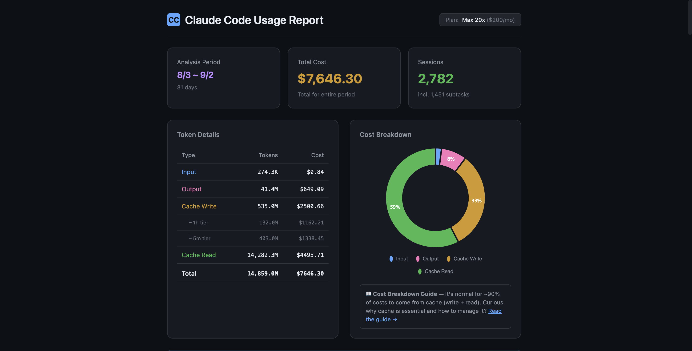

# Fable 5.1 Costs at Least 24–38% Less Than Opus 5

**Research period**: 2026-08-03 ~ 2026-09-02 (31 days)
**Environment**: Claude Code, macOS, Max 20x plan, mixed Korean/English dialog
**Sample size**: 2,782 sessions (1,331 main + 1,451 subagents), 14.86B tokens, $7,646 billed
**Method**: `/usage-view` (super-token-saver v3.3.0), subagent-replay deduplication applied
**Price basis**: Anthropic's published API list prices. Subscription-plan rate limits (Max 5-hour / weekly windows) deduct differently; see Appendix A.

> 한국어: [fable-5-1-vs-opus-5-cost-analysis.ko.md](./fable-5-1-vs-opus-5-cost-analysis.ko.md)

---

## 0. Executive Summary

### At equal quality it costs 24–38% less. Long sessions push it further.

Fable 5.1 scores higher than Opus 5 on **every benchmark Anthropic published for both models** (§1). The cost
comparison therefore does not require a quality trade-off.

Because Fable 5.1 reaches a given score at a **lower effort setting**, it burns fewer tokens getting
there. Lower effort also means less thinking per turn.

At equal score, Anthropic's CursorBench effort curves put Fable 5.1 at **24–38% cheaper** than
Opus 5 (values read off the charts, ±5% on cost). These are final per-task dollar figures computed with each model's own price sheet, so
Fable 5.1's higher input and output rates are already included.

Those benchmarks are short single-task runs. In long autonomous sessions, cache read becomes the
**single largest line on the bill**, and Fable 5.1's cache-read price is half of Opus 5's. In 31
days of real usage, the measured token mix reproduces a 44.5% reduction from Fable 5 to Fable 5.1,
matching Anthropic's "up to approximately 45%" estimate for highly agentic work.

So the 24–38% is a floor set by short tasks. The longer the session, the more of the bill is cache
read, and the further Fable 5.1 pulls ahead (§3). Every billing figure in this report comes from
super-token-saver's `/usage-view` (§4).

---

## 1. The model is better, so it needs less effort

Anthropic's published benchmark table puts Fable 5.1 ahead of Opus 5 on **every metric listed**:

| Benchmark | Fable 5.1 | Opus 5 |
|---|---|---|
| Terminal-Bench-Science 0.1 | **52.6%** | 29.0% |
| Terminal-Bench 4.0 | **55.8%** | 52.3% |
| GDPval-AA v2 | **1853** | 1824 |
| OSWorld 2.0 (strict) | **41.7%** | 39.6% |
| Humanity's Last Exam (no tools) | **60.9%** | 56.6% |
| Humanity's Last Exam (with tools) | **65.0%** | 63.6% |
| AutomationBench | **31.4%** | 26.9% |
| CursorBench 3.2.0 | **73.4%** | 70.0% |

*Terminal-Bench-Science 0.1 carries ±3.5–4.5 pt standard error per model. Source: [anthropic.com/claude-fable-and-mythos-5-1](https://www.anthropic.com/claude-fable-and-mythos-5-1)*

A higher score is not yet a lower cost. What decides cost on long-running work is the effort
setting, and Anthropic says this about it (Claude Code defaults Fable 5.1 to High):

> "when set to Low or Medium effort, Fable 5.1 achieves results similar to or better than Fable 5's
> at a much lower cost. (Note that Fable 5.1 defaults to High effort in Claude Code, and to Medium
> in Claude Cowork and on Claude.ai.)"

But that effort comparison is against **Fable 5, not Opus 5**. On this page Anthropic publishes
accuracy-vs-cost curves by effort level (low / med / high / xhigh / max) for Fable 5.1 against
Fable 5 (and Mythos) only, never Opus 5; per-effort Fable 5.1 vs Opus 5 figures are not published. So one more document was
needed to make the comparison.

### The argument Opus 5 launched on

Opus 5's own announcement ([Jul 24, 2026](https://www.anthropic.com/news/claude-opus-5)) framed
the model as a price play against Fable 5:

> "It's a thoughtful and proactive model that comes close to the frontier intelligence of Claude
> Fable 5 **at half the price**."

> "On CursorBench 3.2, at max effort, the model performs within 0.5% of Fable 5's peak score, but
> **at half the cost per task**; it also achieves greater performance at a given cost than all other
> models on **high, xhigh, and max effort**."

CursorBench triangulates cleanly across both announcements:

| CursorBench 3.2 | Score |
|---|---|
| Fable 5 (peak) | 70.5% |
| Opus 5 | 70.0% — *"within 0.5% of Fable 5's peak"* |
| **Fable 5.1** | **73.4%** |

So Opus 5's proposition was: **near-Fable quality, half the price.** Both halves have now moved.
Fable 5.1 is no longer near-parity. It is ahead on every published benchmark. And "half the price"
was measured against Fable 5's cache-read rate of $1.00 per million tokens, which is now $0.25.

Anthropic has not republished those effort-level accuracy-vs-cost curves against the new cache-read
price. This report measures what that repricing does on a real workload (§3).

### Putting Fable 5.1 and Opus 5 on one axis

Neither announcement plots Fable 5.1 against Opus 5. But both plot **Fable 5** on **CursorBench
3.2.0**, on the same axis: score vs cost per task, USD, log scale, effort ladder low→max. The
Fable 5 curve is identical in both charts, which makes it a valid bridge.

Overlaid (values read off the published charts, ±0.2 pt score / ±5% cost):

| Effort | Opus 5 | Fable 5.1 | Fable 5 *(bridge)* |
|---|---|---|---|
| low | $2.45 / 62.8 | $2.9 / **66.2** | $4.5 / 62.1 |
| med | $3.2 / 64.2 | $3.5 / **68.1** | $6.9 / 65.1 |
| high | $4.0 / 66.7 | $4.8 / **69.4** | $8.7 / 66.5 |
| **xhigh** | $7.3 / 69.3 | **$7.2 / 72.7** | $11.8 / 68.4 |
| max | $8.5 / 70.0 | $9.5 / **73.4** | $17.5 / 70.5 |

Fable 5.1 is above Opus 5 at every effort level, and the cost gap is small enough that it inverts
when you compare at equal score rather than equal effort:

- **At xhigh the cost is about the same and the score is not.** $7.2 vs $7.3 is inside the chart's
  reading error, and the score gap is **+3.4 pts**. There is no price argument at this point on the ladder.
- **Fable 5.1 at low (66.2) comes within 0.5 pt of Opus 5 at high (66.7), for about 27% less.**
- **Opus 5's ceiling is 70.0 at max ($8.5).** Fable 5.1 passes it between high and xhigh, at around
  $5.2, roughly **38% cheaper than Opus 5's best**.
- **73.4 is out of reach for Opus 5 at any effort setting.**

Note how far the curve moved between Fable 5 and Fable 5.1: low $4.5 → $2.9 (−36%), max $17.5 →
$9.5 (−46%). That shift bundles two things: the new cache-read price, which is already in these
charts, and a different model doing a different amount of work. Anthropic's "up to approximately
45%" is the repricing alone, and §3 reproduces that part from billing data.

#### Priced at equal score

For an equal-score comparison, select a quality target and compare what each model charges to hit
it. Fable 5.1's cost is linearly interpolated between its published effort points.
(Geometric interpolation shifts these figures by 0.3–1.5%, well inside the ±5% chart-reading error.)

| Target score | Opus 5 | Fable 5.1 | Saving |
|---|---|---|---|
| 66.7 | $4.00 (high) | ~$3.06 | **−24%** |
| 69.3 | $7.30 (xhigh) | ~$4.70 | **−36%** |
| 70.0 *(Opus 5's ceiling)* | $8.50 (max) | ~$5.24 | **−38%** |
| above 70.0 | unreachable | $5.24 → $9.50 | — |

**The gap widens as the quality bar rises**, and above 70.0 there is no comparison left to make.

These dollar figures are Anthropic's per-task costs computed with each model's own price sheet.
Fable 5.1's 2× input/output rates and $0.25 cache read are already inside them. No further price
adjustment applies.

**This bridge exists for exactly one benchmark.** CursorBench 3.2.0 is the only chart where Fable 5
appears on both pages with a full effort ladder. Terminal-Bench 4.0 on the Fable 5.1 page plots
Mythos 5.1 / Fable 5.1 / Mythos 5. It has no shared model with the Opus 5 page, so it cannot be bridged.
Frontier-Bench v0.1 appears only on the Opus 5 page, where **Opus 5 beat Fable 5 decisively at every
effort level** (roughly +10 pts at a lower cost per attempt); Fable 5.1 was never published on it,
so that gap cannot be re-evaluated here.

One early-access partner states this report's conclusion outright:

> "We're moving our Opus 5 traffic in Devin to Claude Fable 5.1 on launch day. It matched or edged
> out Fable 5 in our testing at a lower cost per task, and with the new cache read pricing a
> Fable-class model is finally economical for the workloads we'd kept on Opus, starting with code
> review."
> — Walden Yan, Co-founder and CPO, Cognition

**What Anthropic does not publish is the Opus 5 price comparison.** Their stated savings, "an
estimated 25% less than Fable 5 for typical workloads" and "up to approximately 45%" for highly
agentic work, are Fable 5.1 **vs Fable 5**. This report measures the other axis: Fable 5.1 vs
Opus 5, on a real 31-day bill.

---

## 2. Faster and easier to read

Lower effort is itself faster because it means less thinking per turn. The effort reduction that
lowers token use can therefore reduce elapsed time as well.

Early-access partners also report that Fable 5.1 is faster than Opus 5 at the same effort and uses
fewer tokens, while maintaining readability over long tasks:

> "It's friendly Fable. Fable-level intelligence, Opus-level price, Sonnet-speed. In our tests it was about twice as fast as Opus 5 and used half as many tokens, so for anyone used to using Opus as their daily driver it's an obvious upgrade."
> — Every / Dan Shipper, CEO

> "On our hardest browser-agent benchmark, Claude Fable 5.1 completed 82% of tasks in about 10 minutes each, against 74% for Opus 5 and 57% for Fable 5, while using fewer tokens than either."
> — Browserbase / Miguel Gonzalez, Technical Lead

> "While prior models became hard to follow the longer they worked, Fable 5.1 remains readable over long, multi-step tasks."
> — Jane Street Capital / Craig Falls, Head of Quantitative Research

These are partner-reported observations, not measurements made in this report. Source for all
three: [Anthropic customer quotes](https://www.anthropic.com/claude-fable-and-mythos-5-1).

---

## 3. Long sessions widen the gap: cache read

The benchmarks above are short single-task runs, where cache read is a small share. Real agentic
work is long sessions, and there cache read becomes the largest line.

### Where the money actually goes

The full 31-day workload, repriced under Opus 5:

| Token type | Tokens | Cost | Share |
|---|---|---|---|
| **Cache read** | 14.28B | **$7,140** | **59.4%** |
| Cache write (5m) | 403.0M | $2,519 | 21.0% |
| Cache write (1h) | 132.0M | $1,320 | 11.0% |
| Output | 41.4M | $1,035 | 8.6% |
| Input | 274.2K | $1.37 | 0.0% |
| **Total** | 14.86B | **$12,015** | 100% |

Cache read is 96.1% of all tokens and 59.4% of all cost. Fresh input is **0.0%**.

This is a typical coding-agent cost profile. Every turn re-sends the entire
conversation; the cache is what keeps that from being catastrophic. The longer and more
autonomous the run, the more the bill collapses onto this one line.

And that one line is the only line Fable 5.1 makes cheaper.

### The multiplier, line by line

| Token type | Opus 5 | Fable 5.1 | Multiplier |
|---|---|---|---|
| Input | $5.00 | $10.00 | 2.0× |
| Output | $25.00 | $50.00 | 2.0× |
| Cache write (5m) | $6.25 | $12.50 | 2.0× |
| Cache write (1h) | $10.00 | $20.00 | 2.0× |
| **Cache read** | **$0.50** | **$0.25** | **0.5×** |

*USD per million tokens. Source: [platform.claude.com/docs/en/about-claude/pricing](https://platform.claude.com/docs/en/about-claude/pricing)*

Fable 5.1 lists at 2× Opus 5. The price sheet lists Fable 5.1 at double Opus 5 across input,
output, and cache writes. Each of those rates is exactly 2×. Every other model except Mythos 5.1
prices cache read at 0.1× its input rate; Fable 5.1 and Mythos 5.1 price it at 0.025×.

Fable 5 was exactly 2× Opus 5 on every line, including cache read at $1.00. Fable 5.1 changed only
cache read to $0.25. Therefore:

```
Fable 5.1 cost = (1 − 0.75 × cache-read share) × Fable 5 cost
```

With the measured 59.4% share, that is 0.555, a 44.5% reduction. This is the same figure Anthropic
quotes as "up to approximately 45%" for highly agentic work, reproduced from independent billing
data.

> "Fable 5.1 will cost an estimated 25% less than Fable 5 for typical workloads, wherever usage is
> billed by token. This is because we're reducing our pricing on cache reads (where the model reads
> inputs that have already been processed and stored). For highly agentic work, the savings will
> often be much larger—up to approximately 45%."

The direction is certain: longer sessions produce a higher cache-read share, which makes Fable 5.1
relatively cheaper. The magnitude beyond the benchmark figures is not measured here.

---

## 4. How this was measured: super-token-saver `/usage-view`

Every billing figure in this report comes from one command. `/usage-view` reads Claude Code's own
transcripts (and Codex sessions) directly, prices each request by token type from the published
price sheet, and renders a self-contained HTML dashboard: cost by model and by token type, the
5-hour rate-limit windows, and every session down to its subagents.



The number this report turns on, cache-read share, is read straight off the token breakdown.

**Subagent replay deduplication.** Claude Code's `runForkedAgent` replays the parent session's
history into each subagent's sidechain, and those replayed rows keep their original `requestId`. A
plain sum counts them twice, and because the replay is almost entirely cache reads, it inflates
exactly the line this analysis rests on. `/usage-view` drops any subagent row whose `requestId`
already appears in the parent's timeline.

| | Cache-read share | Implied Fable 5 → 5.1 saving |
|---|---|---|
| Without dedup | 65.7% | 49.3% (above the ceiling Anthropic states) |
| With dedup | 59.4% | 44.5% (matches "up to approximately 45%") |

The corrected figure lands on Anthropic's number; the uncorrected one overshoots it.

Run it with `/usage-view` in Claude Code. Results are cached per session, so re-running is free, and
`/usage-view private` strips prompt text so the report can be shared.

**Scope.** Single account, 31 days, one workload profile: long-session autonomous multi-agent
sprints. Your cache-read share will differ. The direction of the effect will not.

---

## 5. What to do with this

1. **Do not price Fable 5.1 at 2×.** At equal quality it is 24–38% cheaper on Anthropic's own charts.
2. **Drop effort one or two steps from where you ran Opus 5.** That is where the saving comes from.
3. **If your sessions are long, expect more than the benchmark figure; measure your cache-read
   share with `/usage-view`.** The higher the share, the wider the gap.

The price sheet says 2×. Anthropic's own charts say 24–38% less at equal quality, and real sessions
push it further.

Every dollar figure above is API list price. If you are on a Max plan, what you actually spend is
5-hour and weekly window percentage, and the window is not billed at list price. Appendix A reports
what we measured.

---

## Appendix A. Subscription windows: what one experiment showed (2026-09-04)

Max plans do not bill dollars; they consume a 5-hour rolling window and a weekly window. Anthropic
does not publish how tokens map to window percentage, so we measured one token type directly.

**Setup.** One Claude Code session with a ~430K-token context, forked into a subagent that called a
no-op shell command 1,000 times in a row. Each call re-reads the full context as prompt-cache read
and produces a few output tokens. Cache writes and output are near zero, so the window movement is
attributable to cache read alone. The 5-hour utilization was read from Anthropic's OAuth usage
endpoint every 50 calls. No other session ran on the account. Same protocol for both models.

| | Opus 5 | Fable 5.1 |
|---|---|---|
| Requests | 995 | 1,001 |
| Cache-read tokens | 441M | 435M |
| Cache-write tokens | 0.5M | 0.7M |
| Output tokens | 9.6K | 10.9K |
| 5-hour window moved | +7 pt | +7–8 pt |

**Finding.** Per cache-read token, the two models consumed the 5-hour window at the same rate,
about 0.011–0.013 points per million tokens (5h utilization is reported as an integer, hence the
range). That is far below what list-price proportionality would imply for either model.

**What it means for this report.** The 24–38% figure and the cache-read multiplier in §3 rest on
list prices, where Fable 5.1's cache read is half of Opus 5's. On a subscription plan the rate
limiter appears to charge cache read per token, not per list dollar. Anyone reasoning "the window
deducts in proportion to price" would conclude Fable 5.1 could drain the window up to about twice
as fast as its list price suggests. We have not verified that; it is a possibility the measurement
leaves open, not a result. Cache write and output were not measured for Fable 5.1, and both weigh
more than cache read on the window.

**Caveats.** One account, one day, integer-resolution utilization, one token type. Both runs showed
the same non-linear step (3 points at call 250, then 1 point per ~250 calls), so the limiter is not
a simple per-request tally; we do not yet know why.

---

*Generated with super-token-saver `/usage-view`: [github.com/ww-w-ai/cc-token-saver](https://github.com/ww-w-ai/cc-token-saver)*
